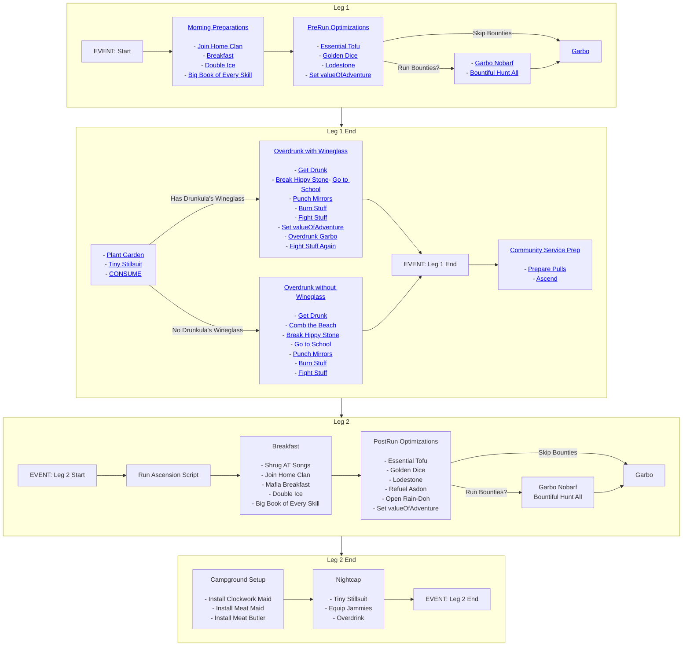

# bLooper

## Table of Contents

1. [Introduction](#introduction)
   - [Features](#features)
   - [Requirements](#requirements)
   - [Installation](#installation)
   - [Usage](#usage)
2. [Contributing](#contributing)
3. [License](#license)

## Introduction

Welcome to bLooper! This little script is all about making your 1-day Community Service ascensions in KoL a breeze. It's a straightforward wrapper that runs the "garbo" script for you, handling both the pre- and post-CS tasks. Plus, it's got a few tweaks and optimizations to help maximize your profits.

bLooper is a spin-off from the well-known [pLooper](https://github.com/prusias-kol/pLooper) by Prusias (#3235855). If you're a fan of the original or just want something tried-and-true, definitely stick with pLooper. But if you're curious about a new take on it, that's where bLooper comes in. It's still in the early stages and doesn't have the track record of pLooper, so expect some rough edges.

Big thanks to Prusias for the inspiration and the groundwork. Feel free to dive into bLooper, and let's see how it spices up your ascensions!

### Features

- **Wrapper for CS Ascensions:** Automates the process of running "garbo" before and after each ascension.
- **Automatic Optimizations:** Includes built-in strategies to enhance profit-making.
- **User-Friendly:** Easy to set up and use, even for those new to scripting.

### Requirements

- All requirements of the CS Script of your choice.

### Installation

```
git checkout glitched94/blooper release
```

### Usage

If you're using bLooper for the first time, run the initialization command `bLooper init`, otherwise just use `bLooper`.
Below is a overview of all the tasks that bLooper performs. Further details for each section of the script can be found in their respective pages.

Note: Each line of the chart below is also a link to the relative documentation for that task. Click them to learn more about what the script is doing!



1. [Leg 1](/docs/leg1.md)
   - [Morning Preparations](/docs/leg1.md#morning-preparations)
   - [PreRun Optimizations](/docs/leg1.md#prerun-optimizations)
   - [Bounties Decision](/docs/leg1.md#bounties-decision)
   - [Garbo](/docs/leg1.md#garbo)
2. [Leg 1 End](/docs/leg1end.md)
   - [Plant Garden and CONSUME](/docs/leg1end.md#plant-garden-and-consume)
   - [Overdrunk Condition](/docs/leg1end.md#overdrunk-condition)
3. [Community Service - Preparing and Ascending](/docs/community-service.md)
   - [Prepare Pulls](/docs/community-service.md#prepare-pulls)
   - [Ascend](/docs/community-service.md#ascend)
4. [Leg 2](/docs/leg2.md)
   - [Run Ascension Script](/docs/leg2.md#run-ascension-script)
   - [PostRun Optimizations](/docs/leg2.md#postrun-optimizations)
   - [Bounties Decision](/docs/leg2.md#bounties-decision)
5. [Leg 2 End](/docs/leg2end.md)
   - [Campground Setup](/docs/leg2-end.md#campground-setup)
   - [Nightcap](/docs/leg2-end.md#nightcap)

## Contributing

Contributions to bLooper are welcome! Please follow these guidelines:

1. Fork the repository.
2. Create a new branch for your feature.
3. Submit a pull request with a clear description of your changes.

## License

MIT License

Copyright (c) 2024 The Powers That Be

Permission is hereby granted, free of charge, to any person obtaining a copy
of this software and associated documentation files (the "Software"), to deal
in the Software without restriction, including without limitation the rights
to use, copy, modify, merge, publish, distribute, sublicense, and/or sell
copies of the Software, and to permit persons to whom the Software is
furnished to do so, subject to the following conditions:

The above copyright notice and this permission notice shall be included in all
copies or substantial portions of the Software.

THE SOFTWARE IS PROVIDED "AS IS", WITHOUT WARRANTY OF ANY KIND, EXPRESS OR
IMPLIED, INCLUDING BUT NOT LIMITED TO THE WARRANTIES OF MERCHANTABILITY,
FITNESS FOR A PARTICULAR PURPOSE AND NONINFRINGEMENT. IN NO EVENT SHALL THE
AUTHORS OR COPYRIGHT HOLDERS BE LIABLE FOR ANY CLAIM, DAMAGES OR OTHER
LIABILITY, WHETHER IN AN ACTION OF CONTRACT, TORT OR OTHERWISE, ARISING FROM,
OUT OF OR IN CONNECTION WITH THE SOFTWARE OR THE USE OR OTHER DEALINGS IN THE
SOFTWARE.
