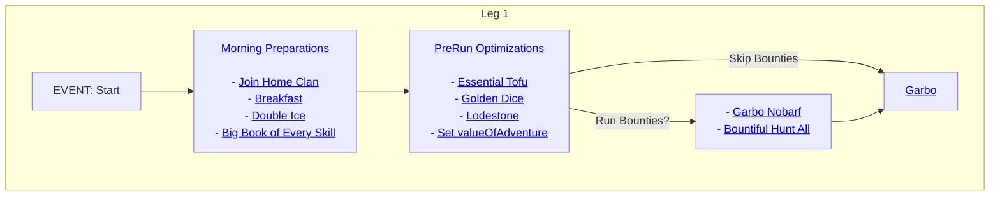

# Leg 1



## Table of Contents

1. [Morning Preparations](#morning-preparations)
   - [Join Home Clan](#join-home-clan)
   - [Breakfast](#breakfast)
   - [Double Ice](#double-ice)
   - [Big Book of Every Skill](#big-book-of-every-skill)
2. [PreRun Optimizations](#prerun-optimizations)
   - [Essential Tofu](#essential-tofu)
   - [Golden Dice](#golden-dice)
   - [Lodestone](#lodestone)
   - [Set valueOfAdventure](#set-valueofadventure)
3. [Bounties Decision](#bounties-decision)
   - [Garbo Nobarf](#garbo-nobarf)
   - [Bountiful](#bountiful)
4. [Garbo](#garbo)

## Morning Preparations

### Join Home Clan

Configurable with the `tptb.bLooper.homeClan` preference. This Task is performed at the start of each leg of the day just to make sure you're in your home clan, in case another script moved you around and didn't move you back for some reason.

```ts
const JOIN_CLAN: Task = {
  name: "Join Home Clan",
  ready: () => args.global.homeClan !== "",
  completed: () => getClanName() === args.global.homeClan,
  do: () => Clan.join(args.global.homeClan),
};
```

### Breakfast

Runs the pre-built Mafia `breakfast` command.

```ts
const BREAKFAST: Task = {
  name: "Breakfast",
  completed: () => get("breakfastCompleted"),
  do: () => cliExecute("breakfast"),
};
```

### Double Ice

Grabs your free daily alotment of [shards of double-ice](https://kol.coldfront.net/thekolwiki/index.php/Shard_of_double-ice) from your clan's [April Shower](https://kol.coldfront.net/thekolwiki/index.php/April_Shower)

```ts
const DOUBLE_ICE: Task = {
  name: "Double Ice",
  completed: () => get("_aprilShower"),
  do: () => cliExecute("shower ice"),
};
```

### Big Book of Every Skill

If you've got a [Big Book of Every Skill](https://kol.coldfront.net/thekolwiki/index.php/The_Big_Book_of_Every_Skill), will attempt to use it and get your daily free skill.

```ts
const BIG_BOOK: Task = {
  name: "Big Book of Every Skill",
  ready: () => have($item`The Big Book of Every Skill`),
  completed: () => get("_bookOfEverySkillUsed"),
  do: () => use($item`The Big Book of Every Skill`),
};
```

## PreRun Optimizations

### Essential Tofu

Attempts to buy and use an [essential tofu](https://kol.coldfront.net/thekolwiki/index.php/Essential_tofu), gives 4-6 turns so values it at the minimum, 4 turns.

```ts
const tofu = $item`essential tofu`;
const ESSENTIAL_TOFU: Task = {
  name: "Essential Tofu",
  ready: () => mallPrice(tofu) < 4 * get("valueOfAdventure"),
  completed: () => get("_essentialTofuUsed"),
  acquire: [
    {
      item: tofu,
      price: get("valueOfAdventure") * 4,
    },
  ],
  do: () => use(1, tofu),
};
```

### Golden Dice

If you have one, uses [Glenn's golden dice](https://kol.coldfront.net/thekolwiki/index.php/Glenn%27s_golden_dice). Gives 5 random positive effects, so _could_ be beneficial to farming.

```ts
const goldenDice = $item`Glenn's golden dice`;
const GOLDEN_DICE: Task = {
  name: "Golden Dice",
  ready: () => have(goldenDice),
  completed: () => get("_glennGoldenDiceUsed"),
  do: () => use(1, goldenDice),
};
```

### Lodestone

Attempts to use a [lodestone](https://kol.coldfront.net/thekolwiki/index.php/Lodestone) if you have one (you should get one). Grants an effect that lets you mine for free several times, and gives +100% meat.

```ts
const lodestone = $item`lodestone`;
const LODESTONE: Task = {
  name: "Lodestone",
  ready: () => have(lodestone),
  completed: () => get("_lodestoneUsed"),
  do: () => use(1, lodestone),
};
```

### Set valueOfAdventure

Configurable with the `tptb.bLooper.leg1ValueOfAdventure` preference. If set, this will let you define different VoAs for different steps of the script. For example, some people value the turns spent in leg2 slightly lower than leg1, because they have fewer resources after their Community Service run.

```ts
const VALUE_OF_ADVENTURE: Task = {
  name: "Set valueOfAdventure",
  completed: () => get("valueOfAdventure") === args.leg1.leg1ValueOfAdventure,
  do: () => set("valueOfAdventure", args.leg1.leg1ValueOfAdventure),
};
```

## Bounties Decision

Setting `tptb.bLooper.getBounties` to `true` will inject 2 pre-garbo steps to the script. If you decide to use this routing, it is _highly_ recommended that you set `bountiful.automaticallyGiveup` to `true`. If you don't, bLooper will get stuck in a loop if it's unable to access the zones necessary for your bounties.

### Garbo Nobarf

Runs, at a minimum, `garbo candydish nobarf ascend`.  
If you have access to [The Sunken Party Yacht](https://kol.coldfront.net/thekolwiki/index.php/The_Sunken_Party_Yacht), it will add `yachtzeechain` to the command.  
If you've configured a workshed with `tptb.bLooper.leg1Workshed`, will add `workshed={your workshed}` to the command.

The command it runs will be printed in the gCLI, e.g., `Running garbo with command 'candydish nobarf ascend yachtzeechain'`.

```ts
const RUN_GARBO_NOBARF: Task = {
  name: "Garbo Nobarf",
  ready: () => myInebriety() <= inebrietyLimit() && args.global.getBounties,
  completed: () => checkLogForEvent(LEG1NOBARF),
  acquire: [
    {
      item: $item`bitchin' meatcar`,
    },
  ],
  do: () => {
    executeGarbo(1, true, true);
    logEvent(LEG1NOBARF);
  },
  limit: {
    tries: 1,
  },
};
```

### Bountiful

Using the [Bountiful](https://github.com/loathers/bountiful) script from Loathers, attempts to run `bountiful hunt all`. It is _highly_ recommended that you configure `bountiful.automaticallyGiveup` to `true`. If you don't, bLooper will get stuck in a loop if it's unable to access the zones necessary for your bounties.

```ts
const BOUNTIFUL: Task = {
  name: "Bountiful",
  ready: () => args.global.getBounties,
  completed: bountiesComplete,
  do: executeBountiful,
};
```

## Garbo

Runs, at a minimum, `garbo candydish ascend`.  
If you have access to [The Sunken Party Yacht](https://kol.coldfront.net/thekolwiki/index.php/The_Sunken_Party_Yacht), it will add `yachtzeechain` to the command.  
If you've configured a workshed with `tptb.bLooper.leg1Workshed`, will add `workshed={your workshed}` to the command.

The command it runs will be printed in the gCLI, e.g., `Running garbo with command 'candydish ascend yachtzeechain'`.

The script expects that you exit garbo with 0 turns left. If for some reason you do have turns leftover, the script will abort as a safety measure.

```ts
const LEG1_GARBO: Task = {
  name: "Garbo",
  ready: () => myInebriety() <= inebrietyLimit(),
  completed: () => checkLogForEvent(LEG1GARBO),
  acquire: [
    {
      item: $item`bitchin' meatcar`,
    },
  ],
  do: () => {
    executeGarbo(1, true, false);

    if (myAdventures() === 0) {
      logEvent(LEG1GARBO);
    } else {
      throw `We still had adventures left over after successfully running garbo, that shouldn't happen.`;
    }
  },
  limit: {
    tries: 1,
  },
};
```
