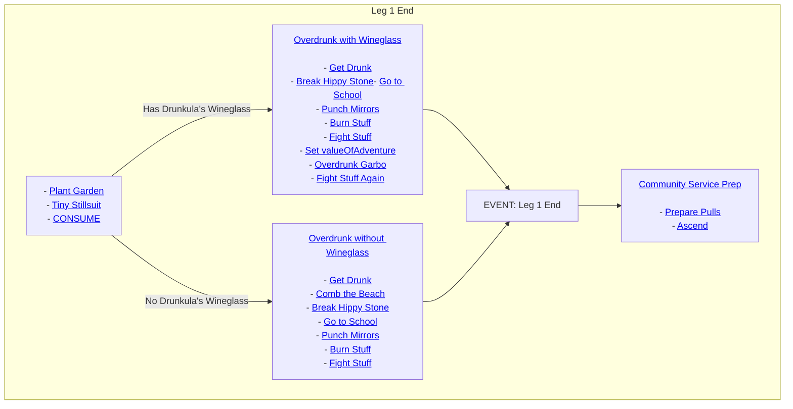

# Leg 1 End



## Table of Contents

1. [Plant Garden and CONSUME](#plant-garden-and-consume)
    - [Plant Garden](#plant-garden)
    - [Tiny Stillsuit](#tiny-stillsuit)
    - [CONSUME](#consume)
2. [Overdrunk with Wineglass](#overdrunk-with-wineglass)
    - [Get Drunk](#get-drunk)
    - [Break Hippy Stone](#break-hippy-stone)
    - [Go to School](#go-to-school)
    - [Punch Mirrors](#punch-mirrors)
    - [Burn Stuff](#burn-stuff)
    - [Fight Stuff](#fight-stuff)
    - [Set valueOfAdventure](#set-valueofadventure)
    - [Overdrunk Garbo](#overdrunk-garbo)
    - [Fight Stuff Again](#fight-stuff-again)
3. [Overdrunk without Wineglass](#overdrunk-without-wineglass)
    - [Get Drunk](#get-drunk-1)
    - [Comb the Beach](#comb-the-beach)
    - [Break Hippy Stone](#break-hippy-stone-1)
    - [Go to School](#go-to-school-1)
    - [Punch Mirrors](#punch-mirrors-1)
    - [Burn Stuff](#burn-stuff-1)
    - [Fight Stuff](#fight-stuff-1)
4. [Community Service Prep](#community-service-prep)
    - [Prepare Pulls](#prepare-pulls)
    - [Ascend](#ascend)

## Plant Garden and CONSUME

### Plant Garden

```ts
const PLANT_GARDEN: Task = {
  name: "Plant Garden",
  ready: () => args.leg1.preAscendGarden !== $item.none && have(args.leg1.preAscendGarden),
  completed: () => stringToGardenItem(myGardenType()) === args.leg1.preAscendGarden,
  do: () => {
    cliExecute("garden pick");
    use(1, args.leg1.preAscendGarden);
  },
};
```

### Tiny Stillsuit

```ts
const stillsuit = $item`tiny stillsuit`;
export const STILLSUIT: Task = {
  name: "Tiny Stillsuit",
  ready: () => have(stillsuit),
  outfit: {
    familiar: $familiar`Stooper`,
    famequip: stillsuit,
  },
  completed: () => myInebriety() > inebrietyLimit() || get("familiarSweat") < 10,
  do: () => cliExecute("drink stillsuit distillate"),
};
```

### CONSUME

```ts
const CONSUME: Task = {
  name: "CONSUME",
  completed: () =>
    myFullness() >= fullnessLimit() &&
    myInebriety() >= inebrietyLimit() &&
    mySpleenUse() >= spleenLimit(),
  do: () => cliExecute("CONSUME ALL"),
};
```

## Overdrunk with Wineglass

### Get Drunk

```ts
const OVERDRINK: Task = {
  name: "Get Drunk",
  completed: () => myInebriety() > inebrietyLimit(),
  do: () => cliExecute(`CONSUME ALL NIGHTCAP VALUE ${get("valueOfAdventure") / 2}`),
};
```

### Break Hippy Stone

```ts
const BREAK_HIPPY_STONE: Task = {
  name: "Break Hippy Stone",
  completed: () => hippyStoneBroken(),
  do: () => visitUrl("peevpee.php?action=smashstone&pwd&confirm=on", true),
};
```

### Go to School

```ts
const diploma = $item`School of Hard Knocks Diploma`;
const GO_TO_SCHOOL: Task = {
  name: "Go to School",
  ready: () => have(diploma),
  completed: () => get("_hardKnocksDiplomaUsed"),
  do: () => use(diploma),
};
```

### Punch Mirrors

```ts
const mirror = $item`punching mirror`;
const PUNCH_MIRRORS: Task = {
  name: "Punch Mirrors",
  ready: () => have(mirror),
  completed: () => get("_punchingMirrorUsed"),
  do: () => use(mirror),
};
```

### Burn Stuff

```ts
const fireStarter = $item`CSA fire-starting kit`;
const BURN_STUFF: Task = {
  name: "Burn Stuff",
  ready: () => have(fireStarter),
  completed: () => get("_fireStartingKitUsed"),
  choices: {
    595: 1,
  },
  do: () => use(fireStarter),
};
```

### Fight Stuff

```ts
const FIGHT_STUFF: Task = {
  name: "Fight Stuff",
  ready: hippyStoneBroken,
  completed: () => pvpAttacksLeft() === 0,
  do: () => {
    const success = cliExecute("PVP_MAB");
    if (!success) throw `Failed to run PVP_MAB for some reason, please check what went wrong.`;
  },
  limit: {
    tries: 1,
  },
};
```

### Set valueOfAdventure

```ts
const WINEGLASS_VALUEOFADVENTURE: Task = {
  name: "Set valueOfAdventure",
  completed: () => get("valueOfAdventure") === args.leg1.wineglassValueOfAdventure,
  do: () => set("valueOfAdventure", args.leg1.wineglassValueOfAdventure),
};
```

### Overdrunk Garbo

```ts
const OVERDRUNK_GARBO: Task = {
  name: "Overdrunk Garbo",
  ready: () => myInebriety() > inebrietyLimit(),
  completed: () => myAdventures() === 0,
  do: () => executeGarbo(1, true, false),
  limit: {
    tries: 1,
  },
};
```

### Fight Stuff Again

```ts
const FIGHT_STUFF_2: Task = {
  name: "Fight Stuff Again",
  ready: hippyStoneBroken,
  completed: () => pvpAttacksLeft() === 0,
  do: () => {
    const success = cliExecute("PVP_MAB");
    if (!success) throw `Failed to run PVP_MAB for some reason, please check what went wrong.`;
  },
  limit: {
    tries: 1,
  },
};
```

## Overdrunk without Wineglass

### Get Drunk

```ts
const OVERDRINK: Task = {
  name: "Get Drunk",
  completed: () => myInebriety() > inebrietyLimit(),
  do: () => cliExecute(`CONSUME ALL NIGHTCAP VALUE ${get("valueOfAdventure") / 2}`),
};
```

### Comb the Beach

```ts
const USE_COMBO: Task = {
  name: "Comb the Beach",
  ready: comboReady,
  completed: () => myAdventures() === 0,
  do: executeCombo,
};
```

### Break Hippy Stone

```ts
const BREAK_HIPPY_STONE: Task = {
  name: "Break Hippy Stone",
  completed: () => hippyStoneBroken(),
  do: () => visitUrl("peevpee.php?action=smashstone&pwd&confirm=on", true),
};
```

### Go to School

```ts
const diploma = $item`School of Hard Knocks Diploma`;
const GO_TO_SCHOOL: Task = {
  name: "Go to School",
  ready: () => have(diploma),
  completed: () => get("_hardKnocksDiplomaUsed"),
  do: () => use(diploma),
};
```

### Punch Mirrors

```ts
const mirror = $item`punching mirror`;
const PUNCH_MIRRORS: Task = {
  name: "Punch Mirrors",
  ready: () => have(mirror),
  completed: () => get("_punchingMirrorUsed"),
  do: () => use(mirror),
};
```

### Burn Stuff

```ts
const fireStarter = $item`CSA fire-starting kit`;
const BURN_STUFF: Task = {
  name: "Burn Stuff",
  ready: () => have(fireStarter),
  completed: () => get("_fireStartingKitUsed"),
  choices: {
    595: 1,
  },
  do: () => use(fireStarter),
};
```

### Fight Stuff

```ts
const FIGHT_STUFF: Task = {
  name: "Fight Stuff",
  ready: hippyStoneBroken,
  completed: () => pvpAttacksLeft() === 0,
  do: () => {
    const success = cliExecute("PVP_MAB");
    if (!success) throw `Failed to run PVP_MAB for some reason, please check what went wrong.`;
  },
  limit: {
    tries: 1,
  },
};
```

## Community Service Prep

### Prepare Pulls

```ts
const calzone = $item`Calzone of Legend`;
const pizza = $item`Pizza of Legend`;
const deepDish = $item`Deep Dish of Legend`;
const time = $item`borrowed time`;
const angle = $item`non-Euclidean angle`;
const tobiko = $item`tobiko marble soda`;
const wasabi = $item`wasabi marble soda`;
const dinsey = $item`one-day ticket to Dinseylandfill`;
const PREPARE_PULLS: Task = {
  name: "Prepare Pulls",
  acquire: [
    {
      item: calzone,
      price: 50 * get("valueOfAdventure"),
    },
    {
      item: pizza,
      price: 50 * get("valueOfAdventure"),
    },
    {
      item: deepDish,
      price: 50 * get("valueOfAdventure"),
    },
    {
      item: time,
    },
    {
      item: angle,
    },
    {
      item: tobiko,
    },
    {
      item: wasabi,
    },
    {
      item: dinsey,
    },
  ],
  completed: haveCsPulls,
  do: () => {},
};
```

### Ascend

```ts
const ASCEND: Task = {
  name: "Ascend",
  completed: () => myPath() === args.afterlife.path,
  do: () => {
    const perms = getPermedSkills();
    const permSkills = new Map(
      Skill.all()
        .filter((s) => have(s) && !perms[s.name] && s.permable)
        .map((s) => [
          s,
          args.afterlife.permType === "hc" ? Lifestyle.hardcore : Lifestyle.softcore,
        ]),
    );

    visitUrl("council.php");
    ascend({
      consumable: args.afterlife.astralDeli,
      pet: args.afterlife.astralPet,
      lifestyle: args.afterlife.lifestyle,
      playerClass: args.afterlife.class,
      kolGender: args.afterlife.gender,
      path: args.afterlife.path,
      moon: args.afterlife.moonSign,
      permOptions: {
        neverAbort: true,
        permSkills,
      },
    });
  },
};
```